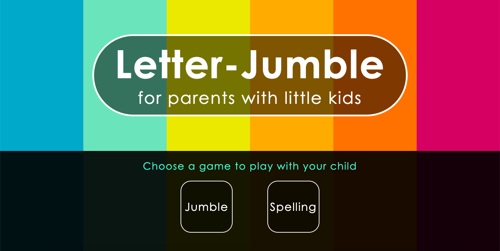
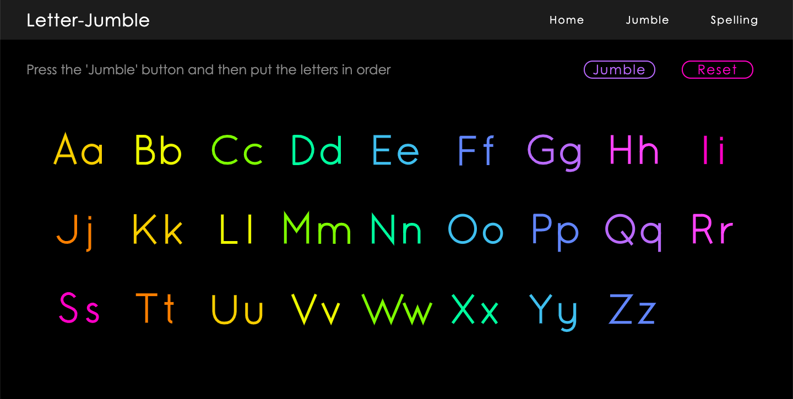
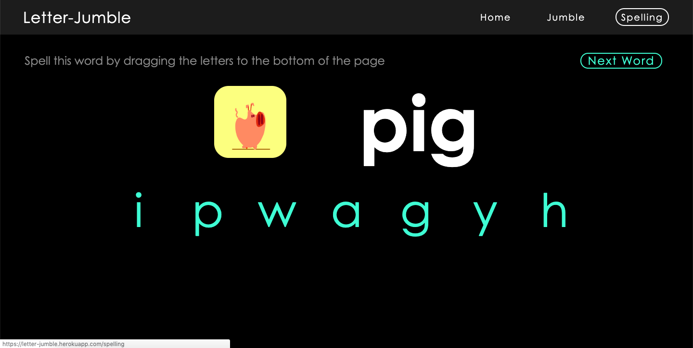

# Letter-Jumble
Interactive learning game created for my 3 year old niece.
The main purpose of the app is to help parents teach the alphabet to their 
young children, while spending quality time together.

## Deployment
You can view the demo in this link:
https://letter-jumble.herokuapp.com/

### `yarn start`

Runs the app in the development mode. 
Open [http://localhost:3000](http://localhost:3000) to view it in the browser.

---

## How it works

Presently, the homepage only features 2 games, which are labelled: 'Jumble' and 'Spelling'. 
 
The 'Jumble' page has the entire alphabet displayed. 
Click on the 'Jumble' button and the alphabet will be shuffled in a random order. 
The parent then helps the child to drag and drop the alphabet back in the correct order.
  
The 'Spelling' page provides a random 3 letter word accompanied by an 
animated gif. 
Underneath is a set of unordered letters, which the child is now required
to drag and drop the correct letters to spell out the word provided. 
When successful, click on 'Next Word' button.

---

## Used Technologies

1) ReactJS
2) react-sortable-hoc
3) Adobe Illustrator

---

### Screenshots

---

## Things I enjoyed

1) My niece loved the colours used and the hover effects  
2) The dark background prevents eye strain when using the app.  
3) My sister is currently using this app to play with my niece.
I'm proud to say that my 3 year old niece was able to learn the entire alphabet
in only 2 days thanks to these interactive games. 

---

## Challenges

1) I'm still learning how to develop in ReactJS. I tested a few React drag and drop
libraries, and react-sortable-hoc was the library I could understand to implement
in my project.  
2) I tried not to use a library for the spelling page, because I wanted to understand 
the algorithm. Unfortunately, you can't drag and drop on a mobile phone or tablet.  
3) I'm still working on making it responsive for smaller devices.  
4) Navigation bar is still a work in progress.  
5) I want to learn to add an animated feature where it rewards the child 
when the exercise is accurately completed.

### From receiving brief to delivering our final presentation, took 2 weeks.